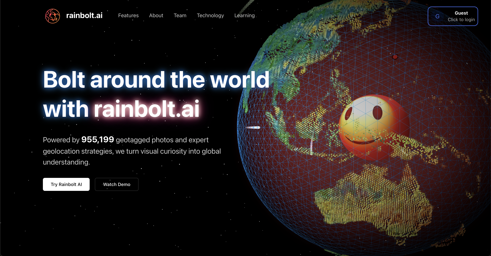
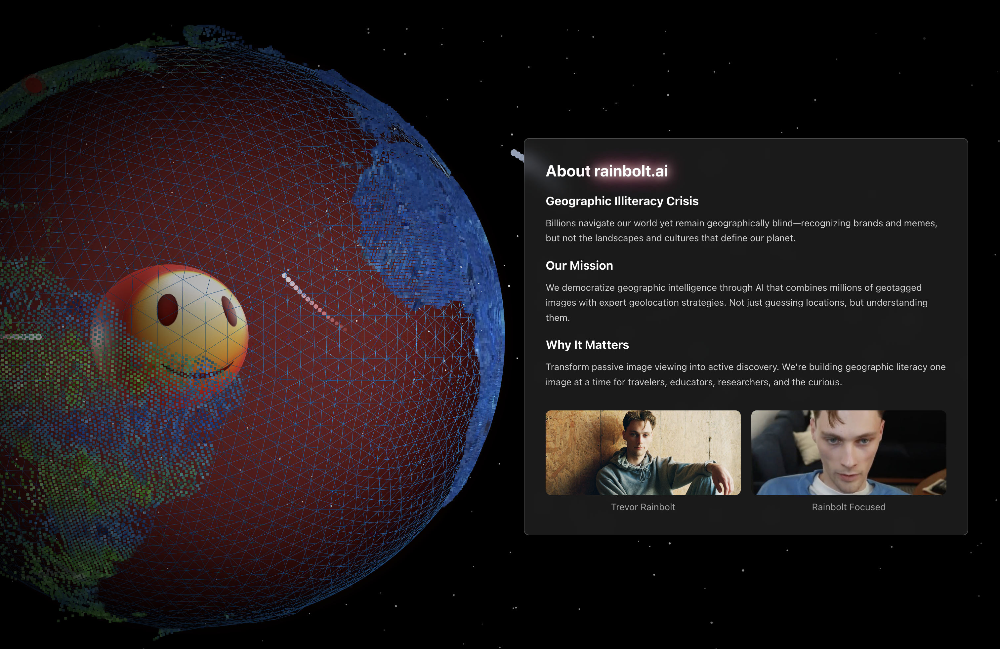
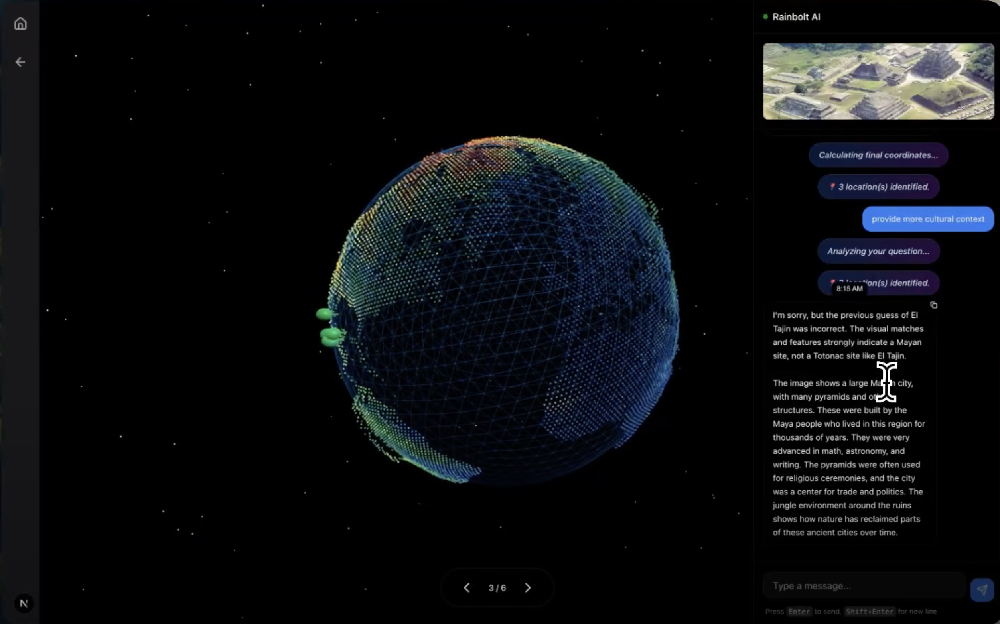
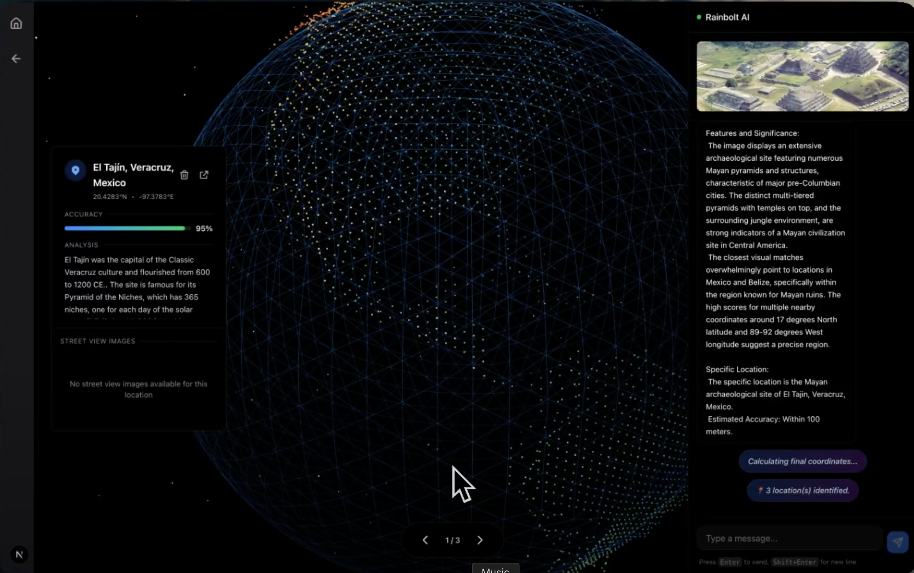
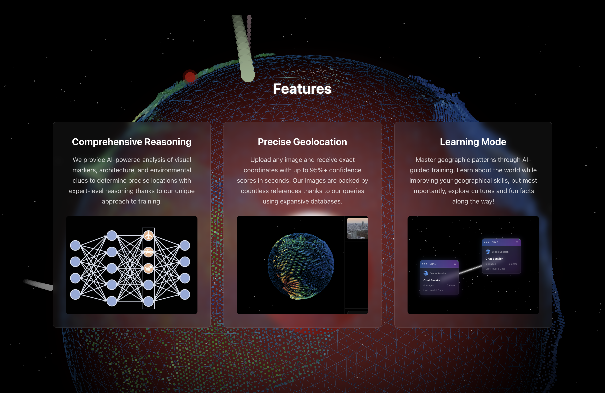
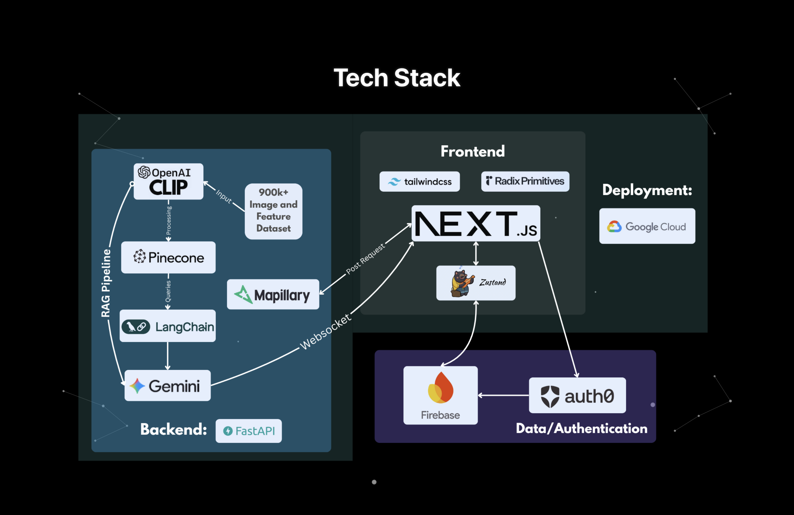
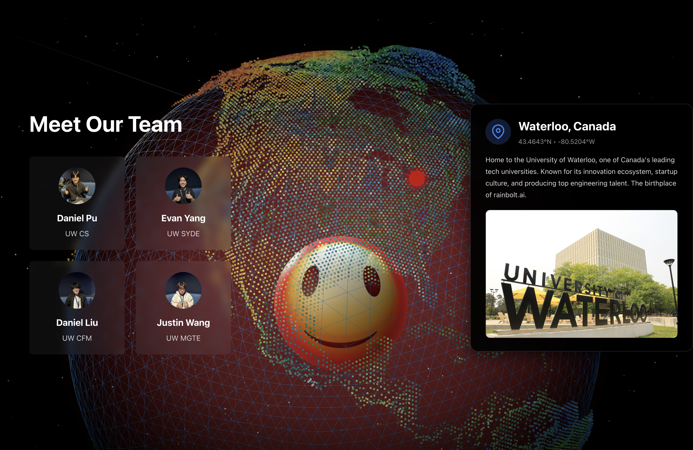

# rainbolt.ai  
** Bolt across the world with AI-powered geolocation  
** Hack the Valley X Winner - Best UI Hack  

  
  

  
---

Overview  
--------

Ever see a photo and think, "This place looks incredible. Where is that?"  
Traditional reverse image search tools rarely work well for geolocation.  
That’s why we built rainbolt.ai: an AI-powered platform that teaches you how to identify real-world locations from any image, providing context, culture, and insight.

rainbolt.ai combines AI, reasoning models, and geographic data to pinpoint coordinates, display nearby street views, and explain its thought process — analyzing road signs, vegetation, architecture, and more.

This project is inspired by Trevor Rainbolt, the world’s most famous geoguesser.

---

Example  
-------

---

Features  
--------

Core Capabilities  
- Image Geolocation: Upload any photo to get precise coordinates.  
- AI Reasoning: Watch the system explain how it identified features.  
- Street View Integration: Explore nearby Mapillary street views.  
- Interactive Chat: Refine or regenerate predictions interactively.  
- Cultural Insights: Learn about landmarks, culture, and geography.  

Technical Features  
- Real-time Streaming using WebSockets for live reasoning updates.  
- Multi-modal Analysis combining visual, textual, and spatial data.  
- Confidence Scoring with transparent accuracy metrics.  
- Dynamic Visualization via interactive globe and constellation views.

---

Architecture  
------------

rainbolt.ai connects multiple systems into a single retrieval-augmented pipeline:

User Image → CLIP Encoding → Pinecone Vector Search → Gemini Reasoning → Mapillary Verification → Cultural Context  

(Add a system diagram here, e.g., docs/images/system-diagram.png)

---

Tech Stack  
-----------

| Category | Technologies |
|-----------|---------------|
| AI & ML | Gemini API, OpenAI CLIP, LangChain, Pillow |
| Backend | FastAPI, Python, WebSockets |
| Frontend | Next.js, React, TypeScript, Tailwind CSS |
| Database | Pinecone (Vector DB), Firebase (Realtime) |
| Infrastructure | Google Cloud, Auth0, Mapillary API |
| State Management | Zustand, Radix UI |

---

How It Works  
------------

1. Image Processing – CLIP encodes visual features into vector embeddings.  
2. Vector Search – Pinecone retrieves similar geographic embeddings.  
3. AI Reasoning – Gemini analyzes matches and approximates coordinates.  
4. Verification – Mapillary street views validate and refine predictions.  
5. Presentation – Frontend displays cultural insights and dynamic visualizations.  

---

Data Sources  
------------

- YFCC100M dataset for embeddings  
- Geoguessr community guides for geographic hints  
- Mapillary API for street-level imagery  
- Global geographic and cultural datasets for context  

---

Hackathon Achievements  
----------------------

- Hack the Valley X (2025)  
- Winner: Best UI Hack (Sponsored by Conrad Mo)  
- Built in 36 hours by a 4-person team

---

Challenges Overcome  
-------------------

- Integrated Three.js for smooth globe animation and camera rotation.  
- Deployed the complete AI pipeline on Google Cloud.  
- Implemented real-time street-level vision via Mapillary API.  
- Tuned Gemini reasoning prompts for consistent accuracy.

---

Future Roadmap  
--------------

- Video Analysis: Extend CLIP to analyze video frames sequentially.  
- Real-time Tracking: Monitor geographic changes over time.  
- 3D Spatial Mapping: Generate depth maps and 3D reconstructions.  
- Cultural Enrichment: Add deeper historical and sociological insights.  
- Mobile App: Native app experience for on-the-go geolocation.

---

Team  
----

| Member |
|---------|
| Daniel Pu |
| Daniel Liu |
| Evan |
| Justin Wang |

---

Links  
-----

- Devpost Submission: https://devpost.com/software/rainbolt-ai  

---

License  
-------

Proprietary. Built for Hack the Valley X 2025.

